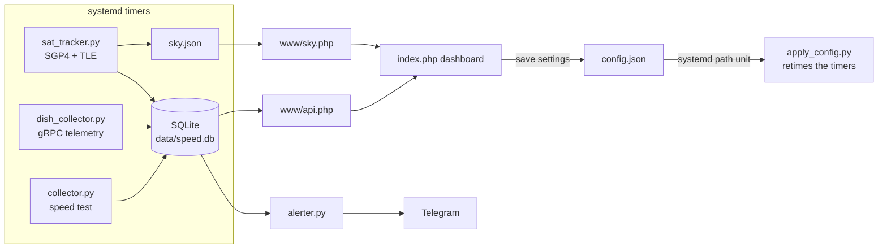

<div align="center">

# 🛰️ Stardashy

**Self-hosted Starlink monitoring dashboard for a Raspberry Pi (or any Linux box on your LAN).**

Speed tests · dish telemetry · live satellite tracking · Telegram alerts — in a clean black-and-white dashboard.


*Unofficial community project — not affiliated with SpaceX or Starlink.*

</div>

---

## What it does

| Module | What you get |
|---|---|
| **Speed tests** | Cloudflare-based download/upload/latency/jitter with a bufferbloat grade, plus ICMP ping and loss. Pure Python stdlib, no speedtest CLI. A result that looks broken is retried, and a failure is logged as a failure rather than averaged in as 0 Mbps |
| **Dish telemetry** | Throughput, PoP latency, drop rate, obstruction, GPS, alignment, hardware alerts and per-second latency percentiles — from the dish gRPC API every minute |
| **⚡ Energy** | The dish reports input power once a second, so this integrates it into real kWh: drawing now, today, this month, projected, per-day and per-year, and the running cost at your own electricity price. Idle draw is a percentile rather than a minimum, and snow-melt periods are tracked separately because they dominate consumption. **The number that matters if you run off solar or a battery** |
| **Data usage** | Actual bytes moved, summed from the dish's per-second throughput buffer — not a rate sampled once a minute and multiplied. Billing cycle, projection, optional cap, daily breakdown, and how much of it was Stardashy's own speed tests |
| **Outage timeline** | Every interruption as a scannable band with an incident table. Causes come from the dish's own log — `Obstructed`, `No satellites`, `Thermal shutdown` — and are grouped by whose problem they are. Availability is measured over observed time only and shown next to that coverage, so a monitoring gap is never counted as an outage |
| **ICMP health** | Continuous reachability tiles for anycast resolvers (Cloudflare, Google, Quad9, OpenDNS, AdGuard, Lumen) with live RTT, a colour-coded history strip and loss. Two Starlink-specific targets are offered — the dish and the CGNAT gateway — which separates "my link to the PoP is bad" from "the internet beyond it is bad" |
| **Throttling** | The dish publishes whether it is being rate limited and why (`POLICY_LIMIT`, `OVERAGE_LIMIT`, `LOW_SPEED_POLICY_LIMIT`). A header badge appears when it is — no more inferring deprioritisation from the shape of a graph |
| **Satellite tracker** | The dish API does not name the satellite serving you, so Stardashy **infers it**: it propagates the public CelesTrak TLE set with SGP4 and matches candidates against the dish boresight. Live sky view and world map. It is a well-informed guess, not ground truth |
| **Test edge** | A labelled chip names the Cloudflare datacentre your speed tests terminate at, with its flag, city and distance from your dish. 216 edge locations are mapped. Deliberately not called "PoP" — the Starlink PoP is a different hop and owns that word on the Dish tab |
| **Telegram alerts** | Test failures, dish offline and recovery, hardware alerts, high drop rate, WAN IP changes — with a delivery queue so alerts survive a Telegram outage |
| **Updates** | The dashboard checks GitHub for new releases and installs them itself. The web server never writes program files: it queues a request that a root-owned systemd unit applies |
| **Dashboard** | Single-page PHP + Chart.js UI: dashboard, dish live view, energy, satellite maps, test log, outage timeline, WAN IP history, network debug tools (ping / MTR / DNS / HTTP), settings |

### Small things

- The tab title carries the current down/up figures and the favicon turns amber on packet loss, red when the link is down — a background tab is still a status light.
- The three headline metrics show the change since the previous test, coloured by whether that direction is good.
- "Last test" counts up in real time, so a stalled collector is obvious.
- Keys `1`–`8` jump between views (ignored while typing in a field).
- JS libraries are vendored locally with a CDN fallback, so the dashboard still loads when your link is down.

## Multiple dishes

Every Starlink dish answers on `192.168.100.1:9200`. That address is fixed in firmware, so two dishes reachable from one host are two different machines at the same address — and no software can tell them apart. **The network has to be made unambiguous first.** Pick whichever fits:

| Approach | How | Suits |
|---|---|---|
| **DNAT on your router** | map `192.168.101.1 → dish A`, `192.168.102.1 → dish B` | OpenWrt, Mikrotik, pfSense — usually the easiest |
| **VLAN or separate subnet** | one dish per VLAN | a managed switch |
| **Network namespace** | one NIC per dish, each in its own netns | a host with two NICs |
| **A collector per site** | reach each dish over SSH from the central host | dishes in different places — the common case |

Then describe each dish in `config.json`:

```json
"dishes": [
  {"id": "home",  "name": "Home",  "target": "192.168.100.1:9200"},
  {"id": "barn",  "name": "Barn",  "target": "192.168.101.1:9200"},
  {"id": "cabin", "name": "Cabin", "target": "192.168.100.1:9200",
   "exec": "ssh pi@cabin", "location": {"lat": 46.5, "lon": 24.5}}
]
```

`target` covers everything that gave the dish its own address. `exec` is a command prefix the gRPC call runs through, which covers namespaces, containers and remote hosts with one mechanism. Omit `dishes` entirely and nothing changes — a single-dish install keeps working exactly as before, and its existing history stays attached to it.

A selector appears in the header once more than one dish is configured. Dish telemetry, energy, data usage and the outage timeline are all kept separate per dish, because averaging two links together produces numbers that describe neither. Speed tests and ICMP probes stay host-level: they measure whatever route the host takes, not a particular dish. Satellite tracking follows the first dish.

> **`exec` is deliberately not editable from the dashboard.** It is a command prefix run by collectors that execute as root, so accepting one over HTTP would turn the admin password into a root shell. Edit it in `data/config.json` as someone who already has root on the box.

## Architecture



Everything is file-based: one SQLite DB, one JSON config, no daemons of its own — systemd timers do the scheduling, a `.path` unit applies settings saved from the UI.

### Small things

- The tab title carries the current down/up figures and the favicon turns amber on packet loss or red when the link is down, so a background tab is still a status light.
- The three headline metrics show the change since the previous test, coloured by whether that direction is good — faster download green, higher latency red.
- "Last test" counts up in real time rather than showing a fixed clock time, so a stalled collector is obvious.
- Keys `1`–`7` jump between views (ignored while typing in a field).

## Requirements

- Linux with systemd (built for Raspberry Pi OS, runs anywhere)
- `python3` (stdlib only) + `sgp4` (only for the satellite tracker)
- [`grpcurl`](https://github.com/fullstorydev/grpcurl/releases) — talks to the dish at `192.168.100.1:9200` (your device must **not** be in bypass-only routing that blocks the dish IP)
- A web server with PHP ≥ 8 and `php-sqlite3` (nginx + php-fpm, Apache, or just `php -S` to try it). No other extensions are required — `mbstring` and `curl` are deliberately not used, since they are not installed by default on Raspberry Pi OS.

## Install

```bash
git clone https://github.com/razvanzeces/stardashy.git
cd stardashy
sudo ./install.sh
```

The installer copies everything to `/opt/cfspeed` (the internal service name is `cfspeed`, kept for compatibility with existing installs), installs the systemd units, seeds `data/config.json` from the example, and vendors the JS libraries so the dashboard works even when your internet is down (which is exactly when you'll be staring at it).

Then serve `/opt/cfspeed/www`. Quick test:

```bash
php -S 0.0.0.0:8080 -t /opt/cfspeed/www
```

nginx example:

```nginx
server {
    listen 80;
    root /opt/cfspeed/www;
    index index.php;
    location ~ \.php$ {
        include snippets/fastcgi-php.conf;
        fastcgi_pass unix:/run/php/php-fpm.sock;
    }
}
```

**First visit:** the Settings/Debug tabs ask you to create an admin password (nothing ships hardcoded). Then set your dish location and, optionally, a Telegram bot.

## Updating

Stardashy checks GitHub for new releases and tells you when one is out — a banner appears at the top of the dashboard, and **Settings → Software Update** shows the release notes with an **Install update** button.

```
dashboard  ──writes──▶  data/update_request.json
                            │  (systemd .path unit)
                            ▼
                        update.py  (root)
                            │  clone/fetch the tag into data/.update-src
                            │  back up the current install
                            └─▶ run install.sh  ──▶  files replaced, timers restarted
```

The web server never writes program files itself — it only queues a request that a root-owned systemd unit picks up. Only the exact tag advertised by the version check can be installed, and only from this repository.

Your database, `config.json` and admin password are untouched by an update. The previous version is kept in `data/.update-backup` in case you need to restore it by hand.

Non-standard layout? `install.sh` honours `CFSPEED_DEST` (install path), `CFSPEED_UNITDIR` (systemd unit directory) and `CFSPEED_WEBGROUP` (web server group).

Prefer doing it yourself? That works too:

```bash
cd /path/to/your/clone && git pull && sudo ./install.sh
```

Version checks hit the GitHub API at most once every 6 hours (cached server-side) and send nothing but the request itself.

## Configuration

Everything lives in `data/config.json` and is editable from the **Settings** tab. Notable keys:

| Key | Default | Notes |
|---|---|---|
| `intervals.speedtest_min` | 30 | ⚠️ each full test moves **~300–400 MB** on a fast link — at 30 min that's ~15–20 GB/day. Raise this if you have a data cap |
| `intervals.dish_s` / `sats_s` | 60 | dish poll & satellite tracker cadence (negligible traffic) |
| `location.lat/lon/alt_m` | null | dish location for the tracker; leave null to query the dish itself (enable *local network access* in the Starlink app → Advanced → Debug data) |
| `location.publish_precision` | 2 | decimals of your position exposed in the public `sky.json` (2 ≈ 1 km) |
| `dish.target` | `192.168.100.1:9200` | dish gRPC endpoint |
| `retention.days` | 0 | prune DB rows older than N days (0 = keep forever; ~165 MB/year at default cadence) |
| `energy.price_per_kwh` | 0 | your electricity price; 0 hides the cost panel |
| `energy.currency` | EUR | label shown next to costs |
| `usage.cycle_day` | 1 | day of month the billing cycle restarts |
| `usage.cap_gb` | 0 | monthly cap for the progress bar (0 hides it) |
| `icmp.interval_s` | 30 | seconds between ICMP probe runs |
| `icmp.good_ms` / `icmp.warn_ms` | 40 / 100 | green up to the first, amber up to the second, red above |
| `icmp.targets` | Cloudflare + Google | up to 8 hosts; loss always outranks latency when picking a colour |
| `speedtest.min_sane_mbps` | 5 | below this the test is considered broken and retried |
| `alerts.*` | — | per-alert toggles and thresholds |

## Privacy & security notes

- `api.php`, `sky.php`, `dish_live.php` are **unauthenticated** (the debug tools and settings are password-gated). They expose your WAN IP history and your approximate location (rounded per `publish_precision`). Fine on a LAN — if you expose the dashboard to the internet, put HTTP auth or a VPN in front of it.
- Secrets (Telegram token, password hash, coordinates) live only in `data/`, which is `.gitignore`d — never commit it.
- The admin password is stored as a PHP `password_hash()` in `data/auth.json`.

## FAQ

**Which satellite am I connected to?** Nobody outside SpaceX knows for sure — the dish switches every ~15 s and the API doesn't expose it. Stardashy shows the *best candidate*: the satellite closest to the dish's boresight among those above the 25° elevation mask, refreshed every minute. It's a well-informed guess, not ground truth.

**Why Cloudflare and not Ookla?** No CLI dependency, no GDPR popups, stable HTTP endpoints (`speed.cloudflare.com`), and edge timing headers that let us subtract server processing time from latency samples.

**The dish tabs show "unreachable".** Check that you can reach `192.168.100.1` from the box (bypass mode + CGNAT routing can block it) and that `grpcurl` is installed.

## Roadmap

Ideas welcome — open an issue. On the list: per-satellite quality correlation, outage timeline export, multi-dish support, Prometheus/Grafana exporter.

## Credits

[CelesTrak](https://celestrak.org) TLE data · [Cloudflare speed test](https://speed.cloudflare.com) endpoints · [Chart.js](https://www.chartjs.org) · [satellite.js](https://github.com/shashwatak/satellite-js) · [world-atlas](https://github.com/topojson/world-atlas)

## License

[MIT](LICENSE) © 2026 Razvan Zeces (YO6RZV)
